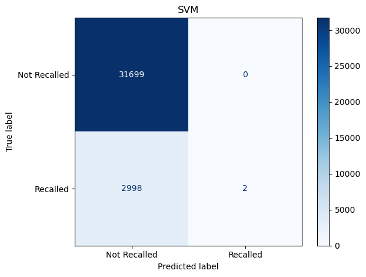
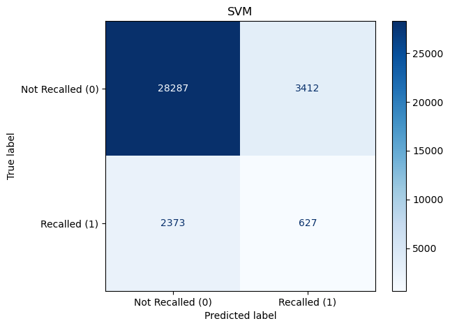

# Total Recall
Team Members: Sam Boardman, Khola Jamshad, Riku Kurama, Yucong Lei, Shivani Prabala

## Table of Contents
1. [Introduction](#introduction)
2. [Data Processing](#data-processing)
3. [Data Exploration](#data-exploration)
4. [Methods](#methods)
5. [Results](#results)
6. [Future Work](#future-work)
7. [Repository](#repository)

## Introduction
Introduction
Recent [workforce reductions at the FDA](https://www.theguardian.com/us-news/2025/apr/17/fda-suspends-quality-control-food-testing-staff-cuts) and the subsequent suspension of a quality-control program at its food-testing laboratories, have elucidated the need for an efficient contamination tracking of food products. Our aim is to predict which products are likely to face recalls and to understand the relationship between recalls and outbreaks using inference modeling to inform further efforts to reduce the risk and harm of contaminated food products.
Our primary company KPIs are as follows
- Prevention rate of contaminated products reaching consumers
- Cost savings to manufacturers from early warnings and avoided recalls

## Data Processing
Our primary dataset is of [FDA recalls](https://datadashboard.fda.gov/oii/cd/recalls.htm) which we filter for food product type and remove miscellaneous features mostly relating to company descriptions. Feature engineering was done to categorize the states included in the distribution of the product and reasons for recall. We append a separate [FDA inspection](https://datadashboard.fda.gov/oii/cd/inspections.htm) dataset to provide a counterbalance of non-recalled food products. Entries in both datasets are matched using their FEI (FDA assigned identifying numbers), _recall bool_ is used to label any entry in both datasets as recalled (1) and the remaining as not recalled (0). We one hot encoded all categorical variables. We had 173494 entries, the data was imbalanced with no recall: 158176 recall: 15318, but it was well-stratified.

For food related outbreaks, we used the CDC database [BEAM](https://data.cdc.gov/Foodborne-Waterborne-and-Related-Diseases/BEAM-Dashboard-Report-Data/jbhn-e8xn/data_preview) which records various disease outbreaks with different pathogen types such as salmonella and Campylobacter from 2018 to 2025. The features that we exploited in this data set are year, month and the pathogen type.

## Data Exploration
We investigated the FDA recall data initially with an interest in whether there was a correlation between the location of the firm and recalls, and also whether certain states were most affected by recalls due to distribution pathways of the product. We see a strong correlation between the firm locations and states most impacted indicating that the firm locations are a good indicator of whether a product will be recalled.

Once we had integrated the recalls and inspections datasets, we also looked at temporal trends by grouping them by months and calculating recalls as a percentage of inspections, which would indicate whether inspection count and times affect recalls. We find that there seems to be some oscillatory behavior in the peaking of recall \% every 4-6 years. While we do not focus on covid years in this project, we did note a high in the covid years which was interesting since the absolute number of recalls was down hinting at a direct impact of workforce reduction. 

Since we had a good understanding of the spatial relation of the FDA recall-inspection data, we wanted to compare it with the outbreak data from BEAM. While there is some correlation particularly for the highest outbreak and recall areas, there are discrepancies. These may be due to the climate since northern areas are colder and therefore less hospitable to the pathogens (Campylobacter, STEC, Shigella, salmonella, and vibrio) that are associated with these outbreaks. We also further looked at the seasonality in the data by taking an average.

At this point, we ran a preliminary random forest classifier to see relative feature importance for predicting recalls and unsurprisingly find state and days since the last inspection to be most important. This lists the 14 features we included later in our models with the exception of city frequency.

## Methods
We investigated 3 different models in comparison to a baseline
- As a baseline model, we used a dummy classifier (DC) which always predict the majority class.
- Logistic regression (LR)
- Random forest classification (RF)
- Support vector machine (SVM)

We first independently tested the RF and SVM models on the data and found that because of the imbalance in the data, we had low scores for predicting recalls. 

To counter this, we included balanced class weights for all 3 models and ran GridSearchCSV to find the best hyperparameters focused on optimizing the recall metric since we were particularly interested in reducing the number of false negatives. SVM takes significantly longer to run since it does not scale well with large datasets. We attempted to counter this by reducing the dataset to only companies that had faced recalls before and while that improved the accuracy significantly, we were concerned that it introduced an unfavorable bias against companies that had a recalled product already. Therefore, we continued with the unreduced data.

## Results
The dummy classifier always predicts the majority class - not recalled. 

Before hyperparameter tuning, we saw that LR and SVM performed just as bad as the dummy model. RF did much better in the F1 score however we still had too many false negatives. Pre-tuning results:

 

After tuning, all 3 models were used with class weight balancing. LR improved it's performance in predicting recalls significantly to a F1 score of 0.23. RF had only a slightly higher F1 score than LR and while SVM improved significantly from before, it did not compete with the other 2 models.

 

After running the cross-validation, we saw that the F1 and precision metrics for predicting recall were the best for RF compared to SVM and LR. Additionally, with RF and LR, we looked at probability based prediction (left: pre tuning and right: post tuning) and decided that RF performed consistently better in all our model tests.

[post ROC](/Images/roc2.png)

## Future Work

We used time series analysis with 7 features: the month and 6 pathogens associated with the outbreaks. 
We used two models: a naive seasonal model and a vector autoregression (VAR) model. For the VAR model, we combined the FDA and the BEAM datasets to better predict future recall probabilities, which however forced us to truncate our available dataset to the timeframe from 2018 to 2025. We also added some aspect of seasonality to the final VAR model by including the variable which records the average recall percentage in the same months over the past three years. 
According to our kfold-split cross validation with k=5, the VAR model without this added seasonality has less predictive power than the naive seasonal model, but the final VAR model with this added seasonality outperformed the seasonal model. 
Figures in order: VAR with no tuning, VAR with seasonality from previous year, VAR with seasonality from past 3 years:

We expect that we can improve our model by including more precise data such as geographical locations and also implementing a regularized VAR model with seasonality (We dealt with seasonality by adding a new variable to the VAR model which captures seasonality, but one can also directly implement a VAR model with seasonality. Also, regularization appears beneficial since our VAR model has many parameters due the number of variables and lags.)  

Additionally, it may also help to look more closely at spatial data - states- and include the climate over time, along with keeping the reasons for recall from test.csv to run inference models and get a better idea of the factors that cause recall which may also help preventative measures for recalls.

## Repository

### Data
[recall_data_save.csv](/Data/recall_data_save.csv) : the original data of recalled items from the FDA recalls API

[test.csv](/Data/test.csv) : cleaned FDA recalls API with feature engineering on distribution states and reasons for recall

[fda_inspections.xslx](/Data/fda_inspections.xslx) : all FDA inspections data from their website

[beam.csv](/Data/beam.csv) : pathogen related disease outbreak data from BEAM database from CDC website

[final_engineered_features.csv](/Data/final_engineered_features.csv) : integrated FDA recalls and inspection data which is used for all model testing

[monthly_recall_percentage.csv](/Data/monthly_recall_percentage.csv) : monthly recall as a percentage of inspections

[cleaning.py](/Data/cleaning.py) and [testing.py](/Data/testing.py): cleaning and feature engineering recalls data requested through [recall-api.py](/Data/recall-api.py)

[match_recall_inspections_data.ipynb](/Data/match_recall_inspections_data.ipynb): combining recalls and inspection data

[feature_selection.ipynb](/Data/feature_selection.ipynb), [geospatial_plot.ipynb](/Data/geospatial_plot.ipynb), [recall_percentage_time_series.ipynb](/Data/recall_percentage_time_series.ipynb): exploratory notebooks. 

### Predictive Models
[dummy_classifier_baseline_model.ipynb](/Predictive_Models/dummy_classifier_baseline_model.ipynb): testing dummy model

[logistic_regression_baseline_model.ipynb](/Predictive_Models/logistic_regression_baseline_model.ipynb): testing logistic model

[random_forest_classification.ipynb](/Predictive_Models/random_forest_classification.ipynb) : testing and optimizing RF with GridSearchCSV

[SVM_recall_cat.ipynb](/Predictive_Models/SVM_recall_cat.ipynb), [SVM_recall_2.ipynb](/Predictive_Models/SVM_recall_2.ipynb) : testing and optimizing SVM with GridSearchCSV

[hybrid_SVM_recall.ipynb](/Predictive_Models/hybrid_SVM_recall.ipynb): optimizing SVM after removing companies without recalls

[model_compare.ipynb](/Predictive_Models/model_compare.ipynb): cross-validation of all 4 models using kfold splits on the same data before and after hyperparameter tuning

[recall_outbreak_inference.ipynb](/Predictive_Models/recall_outbreak_inference.ipynb): initial time series analysis using naive and VAR model to use outbreak data to help predict monthly recall percent

### Images
Assets for README.md

### Deliverables
Executive summary and presentation

